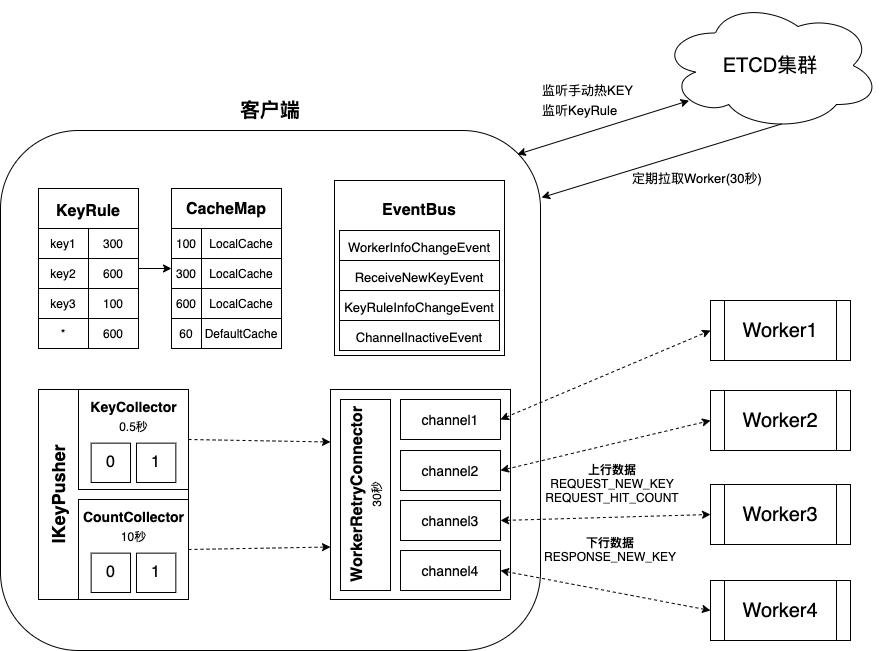

# Client客户端

### 整体架构图



### 客户端使用

我们要在应用中使用hotkey客户端，需要如下四个步骤：

- 引入jar包依赖
- 配置ETCD和APPNAME
- 启用ClientStarter
- 使用JdHotKeyStore

**引入jar包依赖**

```xml
<dependency>
    <groupId>com.jd.platform.hotkey</groupId>
    <artifactId>hotkey-client</artifactId>
    <version>${version}</version>
</dependency>
```

**配置ETCD和APPNAME**

使用前，我们只需要定义我们的应用名称以及ETCD集群服务器即可。

**启用ClientStarter**

```java
ClientStarter.Builder builder = new ClientStarter.Builder();
ClientStarter starter = builder
                .setAppName(appName)    //设置APPNAME
                .setEtcdServer(etcd)    //设置ETCD集群
                .setPushPeriod(500)     //设置上报间隔时间
                .setCaffeineSize(20000) //设置本地缓存大小
                .build();
starter.startPipeline();
```

**使用JdHotKeyStore**

hotkey是侵入式的，我们需要在代码中去维护，但是使用还是比较简单。

```java
public String get(String key) {
    Object object = JdHotKeyStore.getValue(key);
    //如果已经缓存过了
    if (object != null) {
        System.out.println("is hot key");
        return object.toString();
    } else {
        String value = getFromRedis(key);
        JdHotKeyStore.smartSet(key, value);
        return value;
    }
}

public void remove(String key) {
    JdHotKeyStore.remove(key);
    //do your job
}
```

### ClientStarter

核心方法`startPipeline()`，我们看看源码：

```java
public void startPipeline() {
    //设置caffeine的最大容量
    Context.CAFFEINE_SIZE = caffeineSize;
    //设置etcd地址
    EtcdConfigFactory.buildConfigCenter(etcdServer);
    //开始定时推送
    PushSchedulerStarter.startPusher(pushPeriod);
    PushSchedulerStarter.startCountPusher(10);
    //开启worker重连器
    WorkerRetryConnector.retryConnectWorkers();
    //启用EventBus
    registEventBus();
    //监听etcd集群
    EtcdStarter starter = new EtcdStarter();
    starter.start();
}
```

**启动过程**

- 开启单线程线程池，每隔0.5秒推送`REQUEST_NEW_KEY`消息
- 开启单线程线程池，每隔10秒推送`REQUEST_HIT_COUNT`消息
- 开启单线程线程池，每隔30秒检查未连接的Worker进行重连
- 启用事件总线EventBus，监听四种事件：
    - WorkerInfoChangeEvent
    - ChannelInactiveEvent
    - ReceiveNewKeyEvent
    - KeyRuleInfoChangeEvent
- 连接ETCD集群，获取KeyRules和Workers信息
- 开启一个单线程线程池，每隔30秒从ETCD集群拉取Workers信息，发送`WorkerInfoChangeEvent`事件
- 开启一个线程，监听ETCD集群KeyRule路径，发现有变更则发送`KeyRuleInfoChangeEvent`事件
- 开启一个线程，监听ETCD集群手动热KEY路径，发现热KEY即发送`ReceiveNewKeyEvent`事件
- Netty在处理与Worker的连接发现连接断开时，发送`ChannelInactiveEvent`事件

**使用过程**

我们在使用hotkey客户端时，只需要`JdHotKeyStore`这个类就可以了，它包含如下几个公共方法：

- `isHotKey(String key)`：判断某个key是否时热key，会触发规则计算
- `get(String key)`：从本地缓存获取，但不触发规则计算
- `getValue(String key)`：从本地缓存获取，同时触发规则计算
- `remove(String key)`：删除本地缓存，同时直接删除ETCD中的热KEY
- `smartSet(String key, Object value)`：如果是热key，那么会将其值缓存到本地，否则do nothing

> **KEY加热过程**：调用`getValue()`从本地缓存获取，如果不为null直接返回；如果本地缓存为null，那么去分布式缓存获取，获取之后调用`smartSet()`写入本地缓存。这个过程频繁持续的话，会导致KEY被加热，当客户端感知到KEY被加热之后，会写入一个默认值`MAGIC_NUMBER`缓存占位。当我们再次调用`getValue()`时，因为对应KEY只有一个占位值，因此仍然返回null，直到我们再次调用`smartSet()`之后这个热KEY就真正的被缓存到本地了！

### 规则计算

首先，key必须命中 **KeyRule** 规则，才会进入后面的规则计算；

其次，规则计算分为两种：

- `REQUEST_NEW_KEY`：本地缓存未命中
- `REQUEST_HIT_COUNT`：本地缓存计数

**REQUEST_NEW_KEY**

本地缓存未命中，同时虽命中本地缓存但是缓存即将过期也会纳入这个规则进行计算。这个数据会每隔0.5秒上报到Worker，由Worker来计算这些KEY是否是热KEY。

上报的数据为：

- 应用名称：`APPNAME`
- 消息类型：`REQUEST_NEW_KEY`
- 消息内容：`List<HotKeyModel>`

HotKeyModel数据有：**createTime**, **key**, **count**

**REQUEST_HIT_COUNT**

不管是否命中了本地缓存，都会进行统计计数，包括总访问次数和缓存命中次数。这个数据会每隔10秒上报到Worker，由Worker来进行数据统计以及判断KEY的热度是否消减。

上报的数据为：

- 应用名称：`APPNAME`
- 消息类型：`REQUEST_HIT_COUNT`
- 消息内容：`List<KeyCountModel>`

KeyCountModel数据有：**createTime**, **key**, **totalHitCount**, **hotHitCount**

> **注意⚠️**：`REQUEST_HIT_COUNT`里面的统计计数其实包含了`REQUEST_NEW_KEY`里面的统计计数！为了快速及时发现热KEY，需要将本地缓存未命中的情况尽快上报(每隔0.5秒)，而统计计数不需要那么及时，默认是每隔10秒上报。所以，我们将其分为两个事件分开上报！

### 热KEY推送

热KEY分为两种：

- 人工添加热KEY
- 机器探测热KEY

**人工添加热KEY**

人工添加热KEY会将热KEY写入ETCD集群，客户端监听到ETCD集群上热KEY的变动，便会写入本地缓存或从本地缓存移除。

**机器探测热KEY**

当Worker探测到热KEY之后，会通过与客户端的Channel发送`RESPONSE_NEW_KEY`消息，客户端收到该消息后，根据消息体判断是热KEY添加还是热KEY移除操作本地缓存。

### 高可用性

首先，Worker是没有状态的，可以部署多台进行扩展，提高可用性的同时也提高了整体计算能力，避免导致热KEY发现的延迟。其次，所有状态都是保存在ETCD集群的，由ETCD集群的高可用来保证我们热KEY探测系统的高可用。

某个Worker挂掉或者连接不上会导致什么影响？

> 如果是Worker挂掉的话，那么其会从ETCD集群的数据中被移除。客户端通过监听ETCD集群会感知到Worker信息的变化，通过发送`WorkerInfoChangeEvent`事件，让Netty连接处理器移除对应挂掉Worker的连接即可。
>
> 如果是Worker连接不上的话，客户端有一个单线程线程池会每隔30秒一直进行重连，直到连接上为止。如果因为网络分区导致客户端一直连接不上，但是Worker与ETCD集群连接正常的话，会导致分到这个Worker的这部分KEY没法检测！
>
> 添加Worker或者移除Worker都会导致客户端上报热KEY时进行重哈希，导致热KEY计算漂移。比如，之前上报到Worker1机器的热KEY可能经过重哈希之后会上报到Worker2机器，因此存在很短的一个时间内计算结果失准的情况，但影响不大。