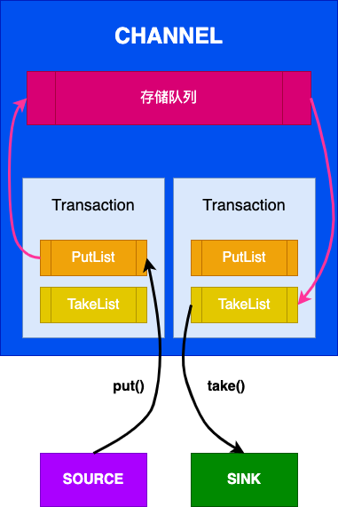
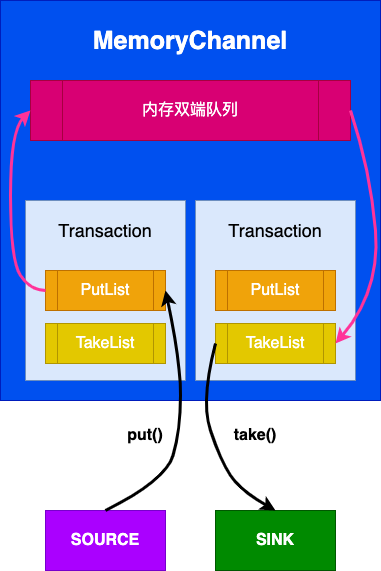
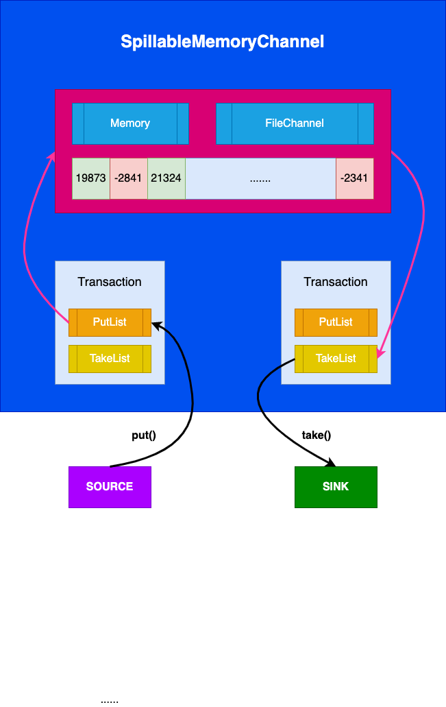

# Channel



Channel 是消息事件(Event)存储的地方，Source往里面写入事件，Sink从里面取出事件。

```java
interface Channel extends LifecycleAware, NamedComponent {

  void put(Event event) throws ChannelException;

  Event take() throws ChannelException;

  Transaction getTransaction();

}
```

Channel的写入和读取都有事务的概念，分为：**写事务(Put)** 和 **读事务(Take)**。事务要么是写事务，要么是读事务，不可能同时是读写事务；Source将开启一个写事务，Sink将开启一个读事务。这些事务都是并发操作的，所有的并发控制都在存储队列的写与读那里。写事务有自己的缓存队列PutList，在事务提交的时候将PutList里面的事件列表写入存储队列，在事务回滚的时候直接丢弃PutList。读事务也有自己的缓存队列TakeList，在事务提交的时候直接清空TakeList，在事务回滚的时候将TakeList里面的事件列表再重新写会存储队列。

Source的操作流程:

- 调用`getTransaction()`方法获取一个事务对象
- 开启一个事务：`tx.begin()`
- 调用`put(event)`方法写入所有消息事件
- 提交事务`tx.commit()`或回滚事务`tx.rollback()`

Sink的操作流程：

- 调用`getTransaction()`方法获取一个事务对象
- 开启一个事务：`tx.begin()`
- 调用`take()`方法不断读取消息事件，直到达到**batchSize**或者Channel为空
- 提交事务`tx.commit()`或回滚事务`tx.rollback()`

Channel的实现类有：

- MemoryChannel
- FileChannel:
- SpillableMemoryChannel
- KafkaChannel
- JdbcChannel
- PseudoTxnMemoryChannel


### MemoryChannel

`MemoryChannel`使用内存双端链表作为存储队列，优点是内存缓存操作快吞吐量大，缺点是出现故障时会丢失数据。



如果内存双端队列已经满了，那么


### SpillableMemoryChannel



`SpillableMemoryChannel` 继承自 `FileChannel`，