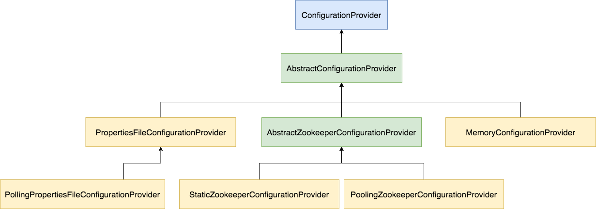

### ComponentType

Flume里面有`组件`的概念，整个Flume就是由各个不同的组件共同组成的，有如下组件类型：

- OTHER(null)
- CONFIG_FILTER("ConfigFilter")
- SOURCE("Source")
- SINK("Sink")
- SINK_PROCESSOR("SinkProcessor")
- SINKGROUP("Sinkgroup")
- CHANNEL("Channel")
- CHANNELSELECTOR("ChannelSelector")

### ComponentConfiguration

ComponentConfiguration是组件的配置父类，有如下几种子类：

- ConfigFilterConfiguration
- SourceConfiguration
- SinkConfiguration
- SinkProcessorConfiguration
- SingGroupConfiguration
- ChannelConfiguration
- ChannelSelectorConfiguration

对应的工厂类：

- ConfigFilterConfigurationType
- SourceConfigurationType
- SinkConfigurationType
- SinkProcessorConfigurationType
- ChannelConfigurationType
- ChannelSelectorConfigurationType

这些都是枚举类，而且都是工厂类，每个类都有工厂方法：`getConfiguration()`，通过这个工厂方法获取对应组件的具体实现类。如：

```java
public enum ChannelConfigurationType {
  OTHER(null),
  MEMORY("org.apache.flume.conf.channel.MemoryChannelConfiguration"),
  FILE("org.apache.flume.conf.channel.FileChannelConfiguration"),
  JDBC("org.apache.flume.conf.channel.JdbcChannelConfiguration"),
  SPILLABLEMEMORY("org.apache.flume.conf.channel.SpillableMemoryChannelConfiguration");

  private String channelConfigurationType;

  private ChannelConfigurationType(String type) {
    this.channelConfigurationType = type;
  }
  public String getChannelConfigurationType() {
    return channelConfigurationType;
  }
  public ChannelConfiguration getConfiguration(String name)
      throws ConfigurationException {
    if (this == OTHER) {
      return new ChannelConfiguration(name);
    }
    Class<? extends ChannelConfiguration> clazz;
    ChannelConfiguration instance = null;
    try {
      if (channelConfigurationType != null) {
        clazz =
            (Class<? extends ChannelConfiguration>) Class
                .forName(channelConfigurationType);
        instance = clazz.getConstructor(String.class).newInstance(name);
      } else {
        return new ChannelConfiguration(name);
      }
    } catch (ClassNotFoundException e) {
      // Could not find the configuration stub, do basic validation
      instance = new ChannelConfiguration(name);
      // Let the caller know that this was created because of this exception.
      instance.setNotFoundConfigClass();
    } catch (Exception e) {
      throw new ConfigurationException(e);
    }
    return instance;
  }
}
```

> **疑问😖：** 这里没有看到具体实现类呀？！比如`MemoryChannelConfiguration`不存在！
>
> **解答😄：** 这里确实没有具体实现类，可能只是为了预留，所以最终还是直接使用了**通用配置类**。
> 通用配置类如下：
> 
> - ConfigFilterConfiguration
> - SourceConfiguration
> - SinkConfiguration
> - SinkProcessorConfiguration
> - SingGroupConfiguration
> - ChannelConfiguration
> - ChannelSelectorConfiguration

只有`SingGroupConfiguration`没有对应的枚举工厂类。

上面这些工厂类统一由`ComponentConfigurationFactory`工厂类调度，看看代码：

```java
public static ComponentConfiguration create(String name, String type, ComponentType component)
    throws ConfigurationException {
  Class<? extends ComponentConfiguration> confType = null;

  if (type == null) {
    throw new ConfigurationException(
        "Cannot create component without knowing its type!");
  }
  try {
    confType = (Class<? extends ComponentConfiguration>) Class.forName(type);
    return confType.getConstructor(String.class).newInstance(type);
  } catch (Exception ignored) {
    try {
      type = type.toUpperCase(Locale.ENGLISH);
      switch (component) {
        case SOURCE:
          return SourceConfigurationType.valueOf(type.toUpperCase(Locale.ENGLISH)).getConfiguration(name);
        case CONFIG_FILTER:
          return ConfigFilterConfigurationType.valueOf(type.toUpperCase(Locale.ENGLISH)).getConfiguration(name);
        case SINK:
          return SinkConfigurationType.valueOf(type.toUpperCase(Locale.ENGLISH)).getConfiguration(name);
        case CHANNEL:
          return ChannelConfigurationType.valueOf(type.toUpperCase(Locale.ENGLISH)).getConfiguration(name);
        case SINK_PROCESSOR:
          return SinkProcessorConfigurationType.valueOf(type.toUpperCase(Locale.ENGLISH)).getConfiguration(name);
        case CHANNELSELECTOR:
          return ChannelSelectorConfigurationType.valueOf(type.toUpperCase(Locale.ENGLISH)).getConfiguration(name);
        case SINKGROUP:
          return new SinkGroupConfiguration(name);
        default:
          throw new ConfigurationException("Cannot create configuration. Unknown Type specified: " + type);
      }
    } catch (ConfigurationException e) {
      throw e;
    } catch (Exception e) {
      throw new ConfigurationException("Could not create configuration! " +
          " Due to " + e.getClass().getSimpleName() + ": " + e.getMessage(),
          e);
    }
  }
}
```

### Context

`Context`是一个Map结构，里面保存了配置键值对。

配置文件key的命名模式：agentName.componentsPrefix.componentName.configKey

其中，`agentName`和`componentName`我们可以自己任意命名；

`componentsPrefix`有五种情况：

- configfilters
- sources
- channels
- sinks
- sinkgroups

> 这里要重点说明的是，Context里面保存的是各个component的真实键值对，即Context里面的所有键都是上面的`configKey`部分（去除了前面三部分的组件所需的配置键）。

### 配置文件

配置文件是Java属性文件格式，一般命名为：`flume-conf.properties`。

每个key以agentName开始，同一个agentName下面所有配置最后会解析到一个`AgentConfiguration`对象。如：

```ini
node1.configfilters = filter1
node1.sources = source1 source2
node1.channels = c1 c2
node1.sinks = sink1 sink2
node1.sinkgroups = sink1 sink2
```

每个`AgentConfiguration`有5大子项：

- ConfigFilterConfiguration
- SourceConfiguration
- ChannelConfiguration
- SinkConfiguration
- SinkGroupConfiguration

### 系统变量

我们可以设置`propertiesImplementation`系统变量，来改变Java属性文件的一些行为，并且实现类必须是`Properties`的子类。目前，Flume可用的实现类有：`EnvVarResolverProperties`。它会将属性文件中所有`${VARNAME}`这种形式的值替换为对应的环境变量，即：`System.getenv(VARNAME)`。

例如：

**flume.properties**

```ini
a1.sources = r1
a1.sources.r1.type = netcat
a1.sources.r1.bind = 0.0.0.0
a1.sources.r1.port = ${NC_PORT}
a1.sources.r1.channels = c1
```

**启动命令**

```bash
NC_PORT=8888 bin/flume-ng agent --conf-file flume.properties --name a1 -Dflume.root.logger=INFO,console -DpropertiesImplementation=org.apache.flume.node.EnvVarResolverProperties
```

### 配置文件参数



从图中我们可以看出，我们的配置参数可以通过配置文件或者zookeeper提供，也可以支持热加载。

**MemoryConfigurationProvider:**
> 
> 这个是EmbeddedAgent使用的配置方式，通过内存MAP提供配置，不支持热加载。

**PropertiesFileConfigurationProvider:**
>
> 通过JAVA属性文件提供配置，不支持热加载。

**PollingPropertiesFileConfigurationProvider:**
>
> 通过JAVA属性文件提供配置，支持热加载。通过一个线程每隔30秒定期轮询配置文件的修改时间，判断配置是否更新，如果配置发生更新就通过Guava的EventBus发送相应的配置变更事件。

**StaticZookeeperConfigurationProvider:**
>
> 通过ZK提供配置，不支持热加载。

**PollingZookeeperConfigurationProvider:**
>
> 通过ZK提供配置，支持热加载。通过WATCH特定的ZK节点来获取配置变更，并用EventBus发送配置变更事件，以应用变更配置。

**启动参数**

```
bin/flume-ng agent -n node -f flume.properties -z 127.0.0.1:2181 -p /flume/configuration
```

> `-n`: 指定Agent名称
>
> `-f`: 指定配置文件路径
>
> `-z`: 指定ZK连接字符串，`-p`: 指定ZK路径，默认值**/flume**，配置文件所在的节点最终路径为指定ZK路径下对应Agent名称的子节点；上面启动命令最终监听的ZK路径为：`/flume/configuration/node`
>
> `--no-reload-conf`: 默认都是热加载配置文件，如果指定了这个选项那么则不会进行热加载！

### 配置热加载

默认情况下是启用了配置热加载机制的，除非我们在启动Flume的时候加上了`--no-reload-conf`选项。Flume通过Guava的EventBus来订阅配置更新事件，具体代码如下：

```java
@Subscribe
public void handleConfigurationEvent(MaterializedConfiguration conf) {
  try {
    lifecycleLock.lockInterruptibly();
    stopAllComponents();
    startAllComponents(conf);
  } catch (InterruptedException e) {
    logger.info("Interrupted while trying to handle configuration event");
    return;
  } finally {
    // If interrupted while trying to lock, we don't own the lock, so must not attempt to unlock
    if (lifecycleLock.isHeldByCurrentThread()) {
      lifecycleLock.unlock();
    }
  }
}
```

通过代码我们可以看出，当Flume在接收到配置变更事件时，会首先通过方法`stopAllComponents()`停止所有已经启动的组件(原配置文件中的所有合法组件)，然后通过方法`startAllComponents(conf)`开启新配置文件中的所有组件。**在热加载的过程中，Flume有一个短暂的时间会出现服务不可用的情况**。