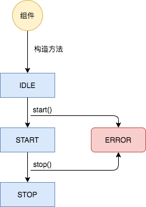

# 组件生命周期监管机制

Flume是由各个组件组成的，如果部分组件在运行中如果出现异常情况导致退出的话，可能会导致整个Flume出现不可用状态，比如Channel组件退出了，那么Source和Sink即使正常运行也没有意义。因此，Flume设计了自己的一套组件生命周期监管机制：`LifecycleSupervisor`，有点类似进程管理工具[Supervisor](http://supervisord.org/)。

涉及的类有：

- LifecycleSupervisor
- LifecycleAware
- LifecycleState
- LifecycleController
- LifecycleException
- SupervisorPolicy
- Supervisoree

### LifecycleState

生命周期状态枚举，有4中状态：

- IDLE
- START
- STOP
- ERROR



### LifecycleAware

`LifecycleAware`是一个接口，我们的组件只需要实现这个接口即可，后面的状态管理就只需要交给`LifecycleSupervisor`就行了。

```java
public interface LifecycleAware {
  void start();
  void stop();
  LifecycleState getLifecycleState();
}
```

实现`LifecycleAware`接口的类有：

- PollingPropertiesFileConfigurationProvider
- PollingZooKeeperConfigurationProvider
- LifecycleSupervisor
- Sink
    - IRCSink
    - DatasetSink
    - HBase2Sink
    - RollingFileSink
    - LoggerSink
    - HDFSEventSink
    - HttpSink
    - KafkaSink
    - HiveSink
    - ElasticSearchSink
- SinkSelector
    - RandomOrderSinkSelector
    - RoundRobinSinkSelector
- SinkProcessor
    - DefaultSinkProcessor
    - FailoverSinkProcessor
    - LoadBalancingSinkProcessor
- SinkRunner
- SourceRunner
    - PollableSourceRunner
    - EventDrivenSourceRunner
- Channel
    - MemoryChannel
    - FileChannel
    - SpillableMemoryChannel
    - KafkaChannel
    - JdbcChannel
    - PseudoTxnMemoryChannel
- Source
    - EmbeddedSource
    - ScribeSource
    - NetcatSource
    - NetcatUdpSource
    - SyslogTcpSource
    - SyslogUDPSource
    - MultiportSyslogTCPSource
    - SpoolDirectorySource
    - TaildirSource
    - ExecSource
    - ThriftLegacySource
    - AvroLegacySource
    - ThriftSource
    - AvroSource
    - HTTPSource
    - KafkaSource
    - StressSource
    - JMSSource
    - SequenceGeneratorSource

### SupervisorPolicy

监管策略，目前有两种实现：

- AlwaysRestartPolicy: 发现组件状态不是预期状态，那么总是重启
- OnceOnlyPolicy: 只启动一次，失败退出以后不再重启

### Supervisoree

被监管的组件的封装类，封装了策略和预期状态：

```java
private static class Supervisoree {
  public SupervisorPolicy policy;
  public Status status;
}
```

### LifecycleSupervisor

`LifecycleSupervisor`创建了一个线程池每隔3秒去扫一遍各组件的状态，它为所有被监管的组件构建一个`MonitorRunnable`类，这个类的作用就是去查看组件的状态是否为预期状态。如果与预期状态一致，那么直接退出；如果不一致，那么操作`start()`或`stop()`方法使其达到预期状态。

> 预期状态只有两种取值：**START**或*STOP**
>
> 如果预期为**START**，那么调用`start()`方法；如果预期为**STOP**，那么调用`stop()`方法；