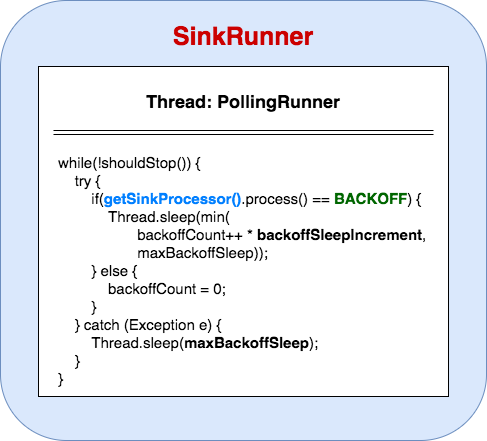
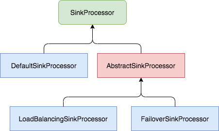

### SinkRunner



SinkRunner负责运行Sink部分的功能，它使用Polling轮询机制从Channel中获取消息事件进行处理。如果处理结果为**BACKOFF**，那么说明需要进行退避处理，进行一定时间的休眠，休眠时间是由`backoffSleepIncrement`和`maxBackoffSleep`两个参数共同决定的。如果连续多次处理结果都是**BACKOFF**，那么休眠时间会每次增加`backoffSleepIncrement`毫秒，最多不超过`maxBackoffSleep`毫秒。如果在SinkProcessor处理过程中抛出异常，那么直接休眠`maxBackoffSleep`毫秒之后再试。

### SinkProcessor

```java
interface SinkProcessor extends LifecycleAware, Configurable {
  /**
   *  The processor is expected to call Sink.process() on
   *  whatever sink(s) appropriate, handling failures as appropriate and
   *  throwing EventDeliveryException when there is a failure to
   *  deliver any events according to the delivery policy defined by the
   *  sink processor implementation. See specific implementations of this
   *  interface for delivery behavior and policies.
   *
   *  Returns READY if events were successfully consumed,
   * or BACKOFF if no events were available in the channel to consume.
   */
  Status process() throws EventDeliveryException;

  /**
   * Set all sinks to work with.
   */
  void setSinks(List<Sink> sinks);
}
```

`SinkProcessor`最终还是会落实到执行`Sink.process()`方法，它的作用是为Sink的消息事件处理提供更多的策略，目前Flume提供了`DefaultSinkProcessor`、`FailoverSinkProcessor`和`LoadBalancingSinkProcessor`三种实现。继承关系如下图：




**DefaultSinkProcessor**

只支持一个Sink，没有任何策略，`SinkProcessor.process()`方法直接透传到`Sink.process()`方法。

**FailoverSinkProcessor**

采用故障转移模式策略，所有Sink会配置优先级(优先级不能相同，否则不会被加入到备选Sink队列里)，优先级最高的Sink会被选为活跃Sink(active sink)。只要活跃Sink在处理的过程中没有抛出异常，那么它将会一直作为活跃Sink；只要发生了异常，那么需要采取故障转移策略，选取下一个优先级最高的作为活跃Sink。如果所有的Sink都故障了，那么`process()`方法将抛出`EventDeliveryException`。

故障Sink队列如何处理？

> 活跃Sink发生故障之后，被移入故障队列，同时会接受相应的惩罚(penalty)，会隔一定时间之后再做重试处理。每次`process()`方法都会遍历故障Sink队列，看看其所受惩罚时间到了么，如果已经过了惩罚时间那么会调用`Sink.process()`方法进行重试。如果返回的状态是 **READY**，那么故障Sink会被重新加入到备选队列里，并且重新选择优先级最高的作为活跃Sink；如果返回的状态是 **BACKOFF** 或者抛出异常，那么其惩罚时间将会加倍，但不会超过我们配置的最大惩罚时间`maxpenalty`。

**LoadBalancingSinkProcessor**

采用负载均衡模式策略，负载均衡模式也有两个子策略：**轮询** 和 **随机**。有一个很重要的配置就是`backoff`，如果我们配置为false(默认值)，那么不会进行退避处理，故障Sink在下一次处理时还是可能被选出来。如果我们将`backoff`配置为true，那么故障Sink将会被移到故障队列，接受一定时间惩罚。如果连续发生故障，那么惩罚时间将加倍，直到达到最大时间`maxTimeOut`。当过了故障Sink的故障惩罚时间，Sink将会重新被加入到选择队列里，以供负载均衡。

无论是采用轮询或者随机的策略，无论backoff设置何值，当当前Sink在处理消息事件发生异常时，`LoadBalancingSinkProcessor`都将会选择下一个Sink继续重试，直到处理成功或所有Sink都发生故障而抛出`EventDeliveryException`。