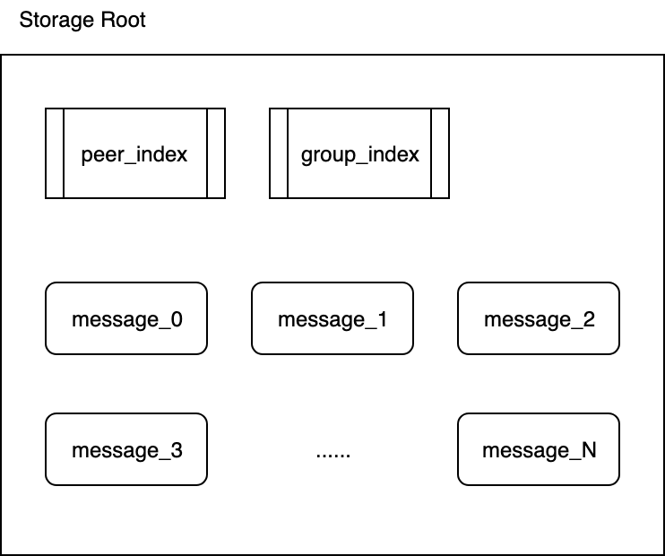
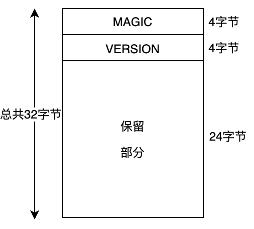
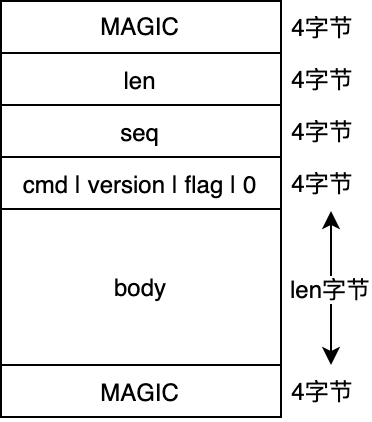

# 消息文件

所有消息存储文件都存储在一个目录里，这个目录由参数`storage_root`指定。

消息存储被划分到不同的块，每个消息块大小为128M，一个消息块对应一个文件。

消息存储文件的文件名为：

- message_0
- message_1
- message_2
- ...
- message_N

其中，数字0、1、2、...N为消息块ID。

```go
const BLOCK_SIZE = 128*1024*1024
```



### 消息ID

每条消息都会对应一个消息ID，这个消息ID是全局唯一且逐渐递增的。

消息ID是该条消息在全局消息文件中的起始位置。

> msgid = BLOCK_SIZE * block_NO + block_offset
> - BLOCK_SIZE：消息块大小(128M)
> - block_NO：消息所在消息块号，从0开始
> - block_offset：消息在对应消息块的起始位置

如何根据消息ID来定位消息所在的块文件以及在块文件中的起始位置？

```go
block_NO = int(msgid/BLOCK_SIZE)
block_offset = int(msgid%BLOCK_SIZE)
```

### 文件格式


消息存储文件由两部分组成，文件头+记录列表。

### 文件头



每个消息块文件都有文件头，文件头大小为32字节。

前面两个4字节分别为：MAGIC、VERSION。

后面24字节作为保留区域，暂未使用，用0进行填充。

### 消息记录



消息并非固定长度，消息的前后分别用来存放MAGIC数字。

cmd、version、flag各占一个字节，最后用0补齐4个字节。

- len：存放消息记录body部分的长度
- seq：TODO
- cmd：
- version：
- flag：
- body：TODO

### 消息写入

`storage_file.go`文件中有两个方法用于将消息写入存储文件：**SaveMessage** 和 **WriteMessage**。

下面我们来看一看这两个方法的定义：

```go
func (storage *StorageFile) SaveMessage(msg *Message) int64
func (storage *StorageFile) WriteMessage(file io.Writer, msg *Message)
```

**SaveMessage**

这个方法用于将消息msg存储到当前打开的文件中，这里的msg是IM服务器通过RPC发送过来的消息。

**WriteMessage**

这个方法用于将消息msg存储到文件file中，这里的msg是从Master主服务器同步而来的消息。

**消息写入流程**

1. 写入MAGIC数字
2. 写入Record Header（len,seq,cmd,version,flag）
3. 写入Record Body（msg.ToData()）
4. 再次写入MAGIC数字
5. 如果当前文件长度大于BLOCK_SIZE，则打开新的块文件（block_NO++）
6. 返回全局消息ID（msgid）

### 消息读取

`storage_file.go`文件中有两个方法用于从存储文件中国呢读取消息：**ReadMessage** 和 **LoadMessage**。

下面我们来看一看这两个方法的定义：

```go
func (storage *StorageFile) ReadMessage(file *os.File) *Message
func (storage *StorageFile) LoadMessage(msgid int64) *Message
```

**LoadMessage**方法根据msgid定位block_NO和block_offsest，然后在block_NO文件的block_offset位置开始读取消息。

`storage_file.go`维护了一个所有打开文件的LRU缓存队列，每次调用LoadMessage方法都会去缓存队列里去取，如果没有取到，那么打开对应的文件。