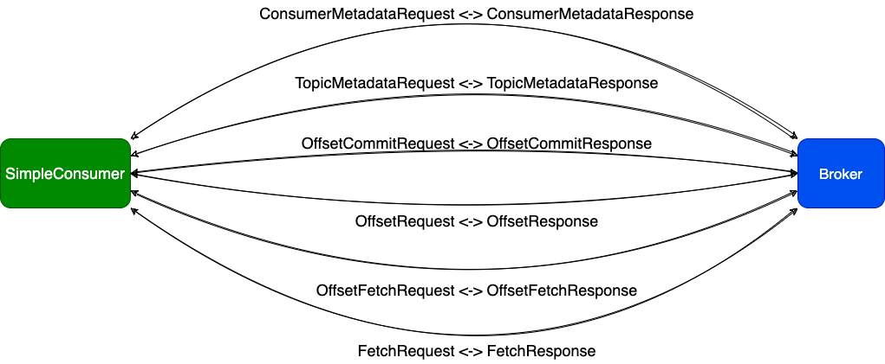

# SimpleConsumer

`SimpleConsumer`算是Kafka内部使用的一个类，用于从指定的Broker消费数据，它只针对指定的Broker进行操作，没有其他的上层逻辑，如自动切换`Leader Broker`等等操作。

与Broker有如下几种操作：

- TopicMetadataRequest
- ConsumerMetadataRequest
- FetchRequest
- OffsetRequest
- OffsetCommitRequest
- OffsetFetchRequest

