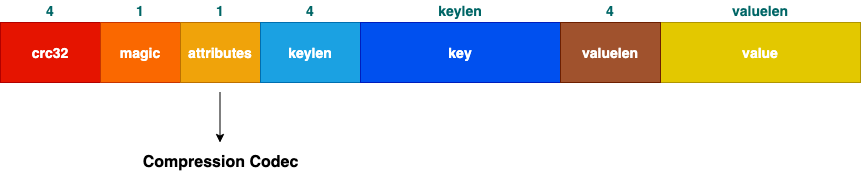

# 一些概念

### GroupId

消费者组ID，由参数`group.id`配置，必须配置。

### ConsumerId

我们通过参数`consume.id`配置的值，默认值为null，如果不设置的话，随机生成一个。

### ConsumerIdString

由两部分组成，消费者组ID和消费者ID。

ConsumerIdString = GroupId + "_" + ConsumerId

### ThreadId

消费者线程ID，数字类型，由0到numStreams-1(numStreams是我们在消费时提供的生成数据流的个数)。注意：这里的"线程"不是真正意义上的线程，只是逻辑意义上的；真正意义上的线程是FetcherId。

### ConsumerThreadId

由两部分组成，一是ConsumerIdString，用来定位具体哪个消费者，二是ThreadId，指定具体哪个逻辑线程。

### TopicAndPartition

包含主题和分区ID两个字段：

- topic: String
- partition: Int

### BrokerAndInitialOffset

指的是我们从Broker获取消息数据的具体Broker和初始位移，包含两个字段：

- broker: Broker
- initOffset: Long

### FetcherId

Consumer底层使用ConsumerFetcherThread去Broker拉取消息数据，每个ConsumerFetcherThread都有一个对应的FetcherId。FetcherId的取值范围为`[0, num.consumer.fetchers)`，是由Topic和Partition的哈希值再与`num.consumer.fetchers`取模求出来的。

### BrokerAndFetcherId

包含两个字段：

- broker: Broker
- fetcherId: Int

### Message

消息实体，用于传输和存储，本质上就是一个ByteBuffer。 

The format of an N byte message is the following:

1. 4 byte CRC32 of the message
2. 1 byte "magic" identifier to allow format changes, value is 2 currently
3. 1 byte "attributes" identifier to allow annotations on the message independent of the version (e.g. compression enabled, type of codec used)
4. 4 byte key length, containing length K
5. K byte key
6. 4 byte payload length, containing length V
7. V byte payload

### ByteBufferMessageSet

消息列表，本质上也是一个ByteBuffer，里面序列化了多条消息。

> A sequence of messages stored in a byte buffer.
>
> There are two ways to create a ByteBufferMessageSet
>
> **Option 1:** From a ByteBuffer which already contains the serialized message set. Consumers will use this method.
>
> **Option 2:** Give it a list of messages along with instructions relating to serialization format. Producers will use this method.

有压缩和非压缩两种格式：

**非压缩格式:**

**压缩格式:**

### MessageAndMetadata

包含两部分：消息和元数据

- rawMessage: Message
- topic: String
- partition: int
- offset: long

### MessageAndOffset

包含两个字段：

- message: Message
- offset: long

### FetchedDataChunk

从Broker获取到的消息数据，包含消息列表及其位移两个主要字段：

- messages: ByteBufferMessageSet
- fetchOffset: Long

### KafkaStream

不断地从channel队列中获取FetchedDataChunk，然后从FetchedDataChunk中不断遍历出ByteBufferMessageSet，再从ByteBufferMessageSet不断遍历出Message，组合成MessageAndMetadata返回。底层的Fetcher会不断地从Broker取数据FetchedDataChunk，并放入channel队列。

包含如下主要字段：

- channel: BlockingQueue[FetchedDataChunk]
- keyDecoder: Decoder
- valueDecoder: Decoder

### 
