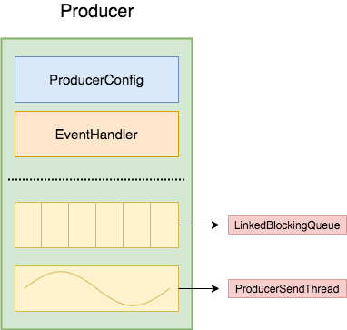
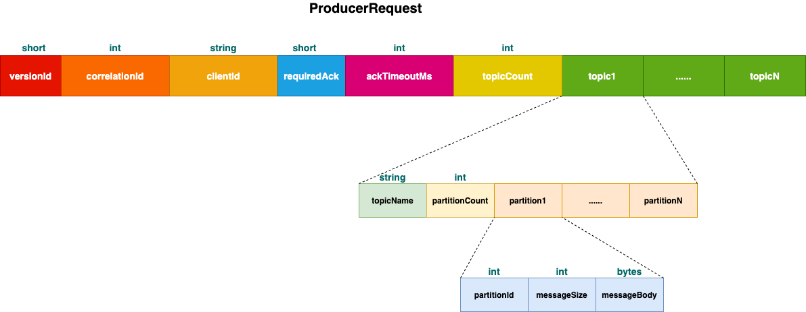
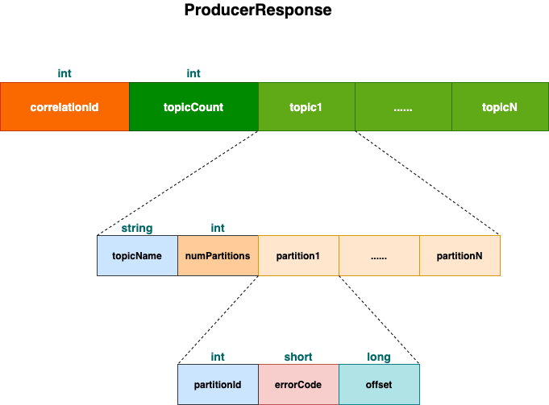

# 生产者

Producer主要字段：

- `config`: ProducerConfig
- `eventHandler`: EventHandler
- `queue`: LinkedBlockingQueue
- `producerSendThread`: ProducerSendThread

Producer主要方法：

- `send(messages)`
- `close()`

我们在使用`Producer`的时候有两种使用模式：`同步` 和 `异步`。

同步模式下，调用`send()`方法会一直阻塞，直到消息成功发送到Broker；同步模式下**producerSendThread**值为null，**queue**队列一直为空。
异步模式下，调用`send()`会将消息数据添加到**queue**队列，然后直接返回，消息队列由**producerSendThread**去批量发送。

无论是同步模式，还是异步模式，消息的发送最终是由`EventHandler`去处理的，所有的核心逻辑都在这个类里面，`Producer`类本身是很简单的。

### EventHandler

生产者的核心发送逻辑都在`EventHandler`里面，我们来看看其默认实现：`DefaultEventHandler`。

DefaultEventHandler 主要包含了5个字段：

- partitioner: 计算消息的分区ID
- encoder: 对消息Value进行序列化
- keyEncoder: 对消息Key进行序列化
- topicPartitionInfos: 缓存话题各个分区元数据
- producerPool: 真正的与Broker进行通信的组件

**ProducerPool**

ProducerPool是真正的与Broker进行通信的组件，之所以称之为Pool，是因为它维护了一个映射池。映射Key为BrokerId，映射Value为`SyncProducer`。SyncProducer负责与具体的Broker进行通信。

### SyncProducer

SyncProducer的配置信息有：

- host: Broker地址
- port: Broker端口
- send.buffer.bytes: socket send buffer size
- client.id: 当前客户端ID
- request.required.acks:  `0` - not wait for acknowledgement `1` - wait for the acknowlegement of leader `-1` - wait for all acknowlegements
- request.timeout.ms: socket read timeout

两类请求：

- TopicMetadataRequest <--> TopicMetadataResponse
- ProducerRequest <--> ProducerResponse

**TopicMetadataRequest**

**TopicMetadataResponse**

**ProducerRequest**

**ProducerResponse**

### 消息发送过程

1、发送消息：producer.send(messages: Seq[KeyedMessage[K,V]])

2、消息序列化：serializedData = eventHandler.serialize(messages)

3、消息分组：partitionedDataOpt = eventHandler.partitionAndCollate(serializedData)

> 两级分组：
>
> 第一级: `Broker`
>
> 第二级: `TopicAndPartition`

4、按Broker分别发送消息：eventHandler.send(brokerid, messageSetPerBroker)

5、如果消息发送失败，那么会根据`retry.backoff.ms`参数休眠一段时间，然后进行重试。如果重试次数超过`message.send.max.retries`参数值，那么不再进行重试而是抛出`FailedToSendMessageException`异常。

> 无论什么原因导致消息发送失败，`Producer`都会去请求并更新对应Topic的元数据信息！