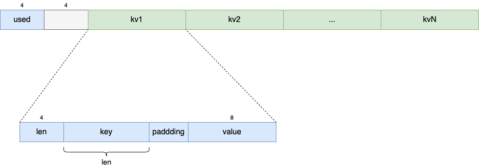

# ValueClass

指标Metric存储的值用的具体类型，有两个选择：

- MutexValue: 单进程模型，使用Lock加锁的浮点类型值
- MultiProcessValue: 多进程模型，本质是MmapedValue类型，返回由进程pid指定的内存映射浮点类型值

ValueClass本质上表示了一个浮点数值，同时拥有三个方法：

- `inc(self, amount)`
- `set(self, value)`
- `get(self)`

以及几个基本属性：

- type
- metric_name
- name
- labelnames
- labelvalues

### MutexValue

单进程模型下的值，很简单，就是在内存中的float变量值。

### MultiProcessValue

多进程模型下，这个值是存储在一个内存映射文件里面的，每个进程会对应有一个值，也即是相应的文件。那么这里就有一个`multiprocess_mode`多进程模型的概念：

- min:
- max:
- all:
- livesum:
- liveall:

文件路径：`${prometheus_multiproc_dir}/${type}[_${multiprocess_mode}]_${pid}.db`

- prometheus_multiproc_dir: 这是我们配置的参数，指标文件目录
- type: 指标类型，可选值有guage/counter/summary/histogram/guagehistogram/info/stateset/unknown
- pid: 这是当前进程的PID
- [_${multiprocess_mode}]: 方括号里的部分只有类型为gauge的时候才会有

### MmapedDict

> A dict of doubles, backed by an mmapped file.
>
> The file starts with a 4 byte int, indicating how much of it is used.
>
> Then 4 bytes of padding.
>
> There's then a number of entries, consisting of a 4 byte int which is the size of the next field, a utf-8 encoded string key, padding to a 8 byte alignment, and then a 8 byte float which is the value.

格式：

